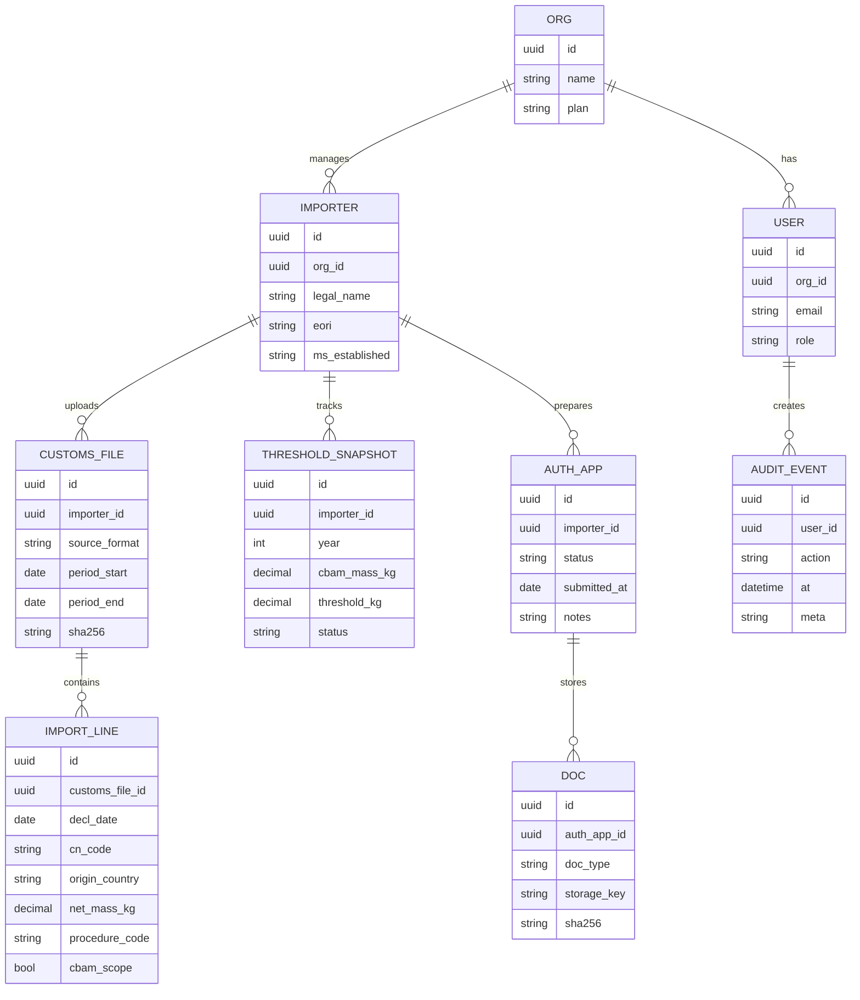
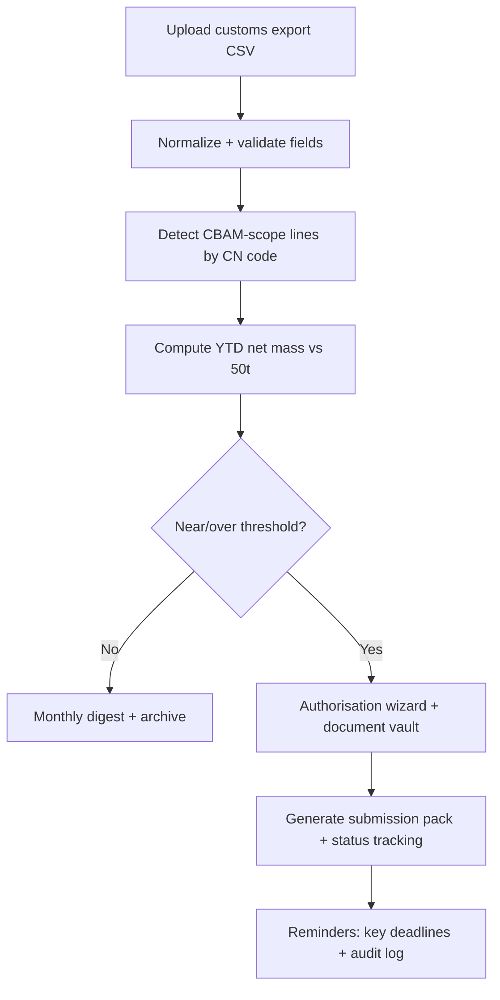

# Ruthless EU Micro‑SaaS Idea With Best ROI Under 6 Months

## Executive Summary

The highest‑ROI EU Micro‑SaaS you can ship in <6 months is a **CBAM Threshold + Authorisation Ops Console** for EU importers (and especially customs brokers acting as/for authorised declarants). The EU CBAM definitive regime started **1 Jan 2026** and requires that CBAM goods be imported only by an **authorised CBAM declarant**, with a new **single mass‑based threshold of 50 tonnes net mass/year** determining whether an importer is exempt; once exceeded, full obligations apply. citeturn0search0turn12search1turn13view2turn13view1 A key near‑term trigger is operational: importers/indirect reps can provisionally continue importing if they applied by **31 Mar 2026**. citeturn11view0

The wedge is brutally specific and defensible: **“CBAM‑scope detection + threshold tracking + application pack + broker multi‑client workflow”**, using only customs declaration exports and deterministic compliance rules (not AI guessing). Distribution is built‑in through EU customs brokers and trade compliance advisors who handle many importers and can adopt tools across clients. The recurring model is per active importer (or per declaration line volume), with onboarding fees for mappings.

## EU Niche Scan

| EU niche (recurring workflow) | Target user + job‑to‑be‑done | Moment of pain trigger | Existing solutions + why they fail | Minimum data + integrations | Willingness‑to‑pay signals |
|---|---|---|---|---|---|
| CBAM threshold + authorised declarant ops | Import/compliance manager or customs broker: “Know if we’re in scope, stay below/track threshold, get authorised, stay audit‑ready.” | Definitive regime live from 1 Jan 2026; exemption only if <50t net mass/year; provisional continuation if applied by 31 Mar 2026; annual declaration/surrender by 30 Sep (first in 2027 for 2026). citeturn0search0turn13view2turn11view0turn11view2turn12search8 | Big trade/GRC suites too broad; consultancies expensive; spreadsheets don’t join customs lines to CBAM scope/threshold and don’t produce a clean application evidence pack. (Inference.) | Customs declaration line export (CSV): importer EORI, CN code, net mass, origin, date, procedure; email/Drive; broker ERP exports. citeturn11view2turn13view2 | Import blockage and penalties risk once threshold exceeded without authorisation; explicit statutory deadlines (31 Mar 2026 application for provisional continuation; 30 Sep annual submission/surrender). citeturn11view0turn11view2turn13view2 |
| VAT OSS/IOSS returns autopilot | Ecommerce finance lead: “File one OSS/IOSS return correctly and pay on time.” | OSS quarterly; IOSS monthly; return + payment due **end of month following period**; reminders/exclusion for persistent failure. citeturn3view0turn4search7 | Tax engines exist but can be overkill for SMBs; accountants still wrangle exports; edge cases (marketplace/deemed supplier) drive manual work. (Inference.) | Shopify/Amazon exports, payment processor CSV, accounting (Xero/QB) exports; VAT rates table; Drive archive. citeturn3view0 | Mandatory periodic filings + payment deadlines; exclusion from scheme is an existential ops risk. citeturn3view0 |
| Intrastat monthly declarations | Ops/finance: “Submit monthly intra‑EU movements with correct codes/values.” | Monthly deadlines set nationally; EU framework allows Member States to set submission deadlines; frequent “month‑end crunch.” citeturn12search11turn0search6 | ERP modules exist but require heavy setup; CN code classification and multi‑system data collection remains manual. (Inference.) | Invoice/shipping data, incoterms, weights, CN codes; accounting + WMS exports; email/Drive. citeturn12search11turn0search6 | Penalties/audits at national level and ongoing reporting burden once thresholds exceeded. (Partly inferred; national practice varies.) citeturn12search11turn12search7 |
| DAC7 platform operator reporting | Marketplace/platform ops: “Collect seller due diligence + submit annual report.” | Annual reporting must be **no later than 31 Jan** after the calendar year of activity. citeturn1search3 | Enterprise tax reporting tools; many startups still use ad‑hoc scripts and legal counsel. (Inference.) | Seller KYC data, payouts, listings/activity; exports from platform DB; accountant export. citeturn1search3 | Statutory reporting deadline; cross‑border platform exposure and penalties. (Penalty specifics vary by Member State.) citeturn1search3 |
| NIS2 incident reporting timer + evidence pack | IT/security manager (in‑scope entity or MSP): “Meet notification deadlines with a defensible record.” | Early warning within **24h**, incident notification within **72h**, final report within **1 month**. citeturn6view0 | Security tooling doesn’t package regulatory notifications; compliance tooling doesn’t integrate incident timelines. (Inference.) | Incident ticket data, timeline, affected services, IoCs; SIEM exports; email templates; Drive vault. citeturn6view0 | Statutory deadlines + enforcement and governance pressure. citeturn6view0 |
| GDPR DSAR tracker | Privacy lead: “Respond to data subject requests within deadline, prove actions taken.” | Must inform on action taken **within 1 month of receipt** (extendable in limited cases with notice). citeturn8view0 | Enterprise privacy platforms costly; ticketing tools miss DSAR‑specific checklists/evidence. (Inference.) | Intake (email/web form), identity verification evidence, data source map; Drive exports. citeturn8view0 | Deadline‑driven compliance and complaint risk. citeturn8view0 |
| TRACES CHED pre‑notification helper | EU importer of animals/food/feed/plants: “Submit CHED correctly to avoid border delays.” | Use of TRACES for CHED for animals/goods entering EU became mandatory; per‑consignment border timing pressure. citeturn4search6turn4search2 | Broker portals + manual re‑keying; multi‑SKU shipments make CHED completion tedious. (Inference.) | Consignment data, HS/CN codes, certificates; broker export; email/Drive; recurring templates. citeturn4search2turn4search6 | Border delays and rejected/invalid certificates create direct cost. (Inference rooted in mandatory process.) citeturn4search6turn4search14 |
| SCIP notifications | Product compliance: “File SCIP data for SVHC‑containing articles.” | Supplying SVHC‑containing articles above 0.1% triggers SCIP obligations. citeturn1search1turn1search9 | PLM/EHS tools heavy; consultants; BOM data often incomplete or not SVHC‑mapped. (Inference.) | BOM + SVHC flags, article identifiers, safe use info; PLM export CSV; Drive. citeturn1search1 | Market access + enforcement risk; repeated across SKUs/updates. citeturn1search9 |
| EUDR due diligence statement ops | Importer/trader: “Create/manage due diligence statements; keep evidence.” | Application postponed until end‑2026; large operators from **30 Dec 2026**, micro/small later; due diligence statements managed in EU information system (dashboard/API). citeturn0search11turn0search3 | Big supply‑chain tools expensive; manual geolocation/evidence collection. (Inference.) | Commodity/product scope, supplier/geolocation evidence, DDS records; Drive; API if high volume. citeturn0search3turn0search11 | Regulation‑driven market access; upcoming fixed date motivates prep budgets. citeturn0search11 |
| REACH Article 33 comms automation | Compliance/CS team: “Answer SVHC info requests in time; standardize disclosures.” | Must provide SVHC info to consumers upon request within **45 days**. citeturn5search1turn5search9 | Email templates + spreadsheets; disconnected from candidate list changes. (Inference.) | Product SKUs, SVHC presence, standard response templates; email; Drive. citeturn5search1 | Statutory response SLA + reputational/legal risk. citeturn5search1turn5search9 |
| F‑gas annual reporting assistant | HVAC/refrigeration supplier/importer: “File annual F‑gas report correctly.” | Annual reporting by **31 March** via portal/tooling; new formats introduced. citeturn5search4turn5search0 | Specialist tools exist but often enterprise‑priced; many SMBs rely on consultants. (Inference.) | Quantities placed on market, recovery/recycling/destruction; ERP CSV; portal submissions. citeturn5search4 | Statutory annual deadline + verification/report upload requirements in some cases. citeturn5search4turn5search8 |
| Dual‑use export controls pre‑check | Export ops: “Classify items, screen destinations, manage licence workflow.” | Per‑order/per‑shipment: export/transit/brokering/tech assistance controls apply to dual‑use items under EU regime. citeturn14search3turn14search15 | Large trade compliance suites expensive; SMEs rely on tribal knowledge + freight forwarder advice. (Inference.) | Product specs, ECCN‑like mapping to EU control list, end‑user/destination; ERP export; screening list feeds. citeturn14search3turn14search15 | High fines/seizure risk (Member State enforcement varies); strong compliance budgets in regulated exporters. citeturn14search15turn14search7 |

## Scoring and Ranking

Scoring: 1–5 (5 best). “Competition intensity” = 5 favorable (lower competition / more white space).

| Niche | Urgency | WTP | MVP ease | Distribution | Competition | Defensibility | Total |
|---|---:|---:|---:|---:|---:|---:|---:|
| CBAM threshold + authorised declarant ops | 5 | 5 | 4 | 4 | 4 | 4 | 26 |
| VAT OSS/IOSS returns autopilot | 4 | 4 | 4 | 5 | 2 | 2 | 21 |
| Intrastat monthly declarations | 4 | 4 | 3 | 4 | 3 | 3 | 21 |
| TRACES CHED import pre‑notification | 5 | 4 | 3 | 3 | 3 | 3 | 21 |
| EUDR due diligence statement ops | 3 | 5 | 2 | 3 | 4 | 4 | 21 |
| DAC7 reporting | 3 | 4 | 4 | 3 | 3 | 3 | 20 |
| NIS2 incident reporting pack + timer | 4 | 4 | 3 | 3 | 3 | 3 | 20 |
| F‑gas annual reporting | 3 | 4 | 3 | 3 | 4 | 3 | 20 |
| Dual‑use export controls pre‑check | 4 | 4 | 2 | 3 | 3 | 4 | 20 |
| GDPR DSAR tracker | 4 | 3 | 4 | 3 | 2 | 2 | 18 |
| SCIP notifications | 3 | 4 | 2 | 3 | 3 | 3 | 18 |
| REACH Article 33 comms | 3 | 3 | 3 | 3 | 3 | 3 | 18 |

Justification (one line per niche, per factor):  
CBAM: Urgency 5 (2026 regime + 31 Mar 2026 application + 50t threshold); WTP 5 (import rights + penalties); MVP 4 (customs CSV + mapping); Dist 4 (brokers); Comp 4 (new); Def 4 (data integrations + workflow). citeturn11view0turn13view2turn12search8turn11view2  
OSS/IOSS: Urgency 4 (monthly/quarterly hard due dates); WTP 4; MVP 4; Dist 5 (accountants/app stores); Comp 2 (crowded); Def 2 (commoditised). citeturn3view0  
Intrastat: Urgency 4 (monthly); WTP 4; MVP 3 (classification/values); Dist 4 (trade advisors); Comp 3; Def 3. citeturn12search11turn0search6  
TRACES: Urgency 5 (border timing; mandatory CHED); WTP 4 (delay cost); MVP 3; Dist 3 (import brokers); Comp 3; Def 3. citeturn4search6turn4search14  
EUDR: Urgency 3 (starts end‑2026); WTP 5 (market access); MVP 2 (evidence/geolocation); Dist 3; Comp 4 (still early); Def 4 (supplier evidence network). citeturn0search11turn0search3  
DAC7: Urgency 3 (annual Jan 31); WTP 4; MVP 4; Dist 3; Comp 3; Def 3. citeturn1search3  
NIS2: Urgency 4 (24h/72h/1 month); WTP 4; MVP 3; Dist 3; Comp 3; Def 3. citeturn6view0  
F‑gas: Urgency 3 (31 Mar annual); WTP 4; MVP 3; Dist 3; Comp 4; Def 3. citeturn5search4turn5search0  
Dual‑use: Urgency 4 (per shipment); WTP 4; MVP 2 (classification complexity); Dist 3; Comp 3; Def 4 (process + evidence). citeturn14search3turn14search15  
GDPR DSAR: Urgency 4 (1 month); WTP 3; MVP 4; Dist 3; Comp 2; Def 2. citeturn8view0  
SCIP: Urgency 3; WTP 4; MVP 2 (BOM/SVHC); Dist 3; Comp 3; Def 3. citeturn1search1turn1search9  
REACH Art.33: Urgency 3 (45 days); WTP 3; MVP 3; Dist 3; Comp 3; Def 3. citeturn5search1turn5search9

## Selected Idea: CBAM Threshold and Authorisation Ops Console

This section specifies the single best EU‑focused idea and the exact “ship in <6 months” plan.

### Exact ICP and niche wording

**ICP (primary):** EU customs brokers / indirect customs representatives serving 10–200 SME importers who import CBAM goods (cement, iron & steel, aluminium, fertilisers, electricity, hydrogen) and must operationalise authorisation + annual CBAM obligations. citeturn12search0turn12search8turn11view2  
**ICP (secondary):** EU‑established SME importers (10–500 employees) with recurring imports who risk unknowingly crossing the **50‑tonne net‑mass threshold**. citeturn13view1turn13view2

**Marketable niche wording:**  
“**CBAM Threshold Tracker + Authorisation Kit** for EU importers and customs brokers: detect CBAM‑scope imports from customs exports, track 50‑tonne threshold in real time, and produce an audit‑ready authorisation application pack + ongoing compliance dashboard.”

### Six‑week MVP must‑have features only

MVP goal: **customs CSV in → “are we in scope / are we near 50t” + “application pack” out**, plus broker multi‑client.

1) **Importer workspace & roles:** Broker org, client importers, user roles (broker admin, client viewer).  
2) **Customs data ingestion (CSV template + mapper):** required fields: importer EORI, CN code, net mass, origin, declaration date, procedure. citeturn11view2turn13view2  
3) **CBAM scope detection:** maintain CN‑code mapping aligned to Annex I categories; tag each line “CBAM / not CBAM.” citeturn11view2turn12search0  
4) **Threshold tracker dashboard:** cumulative net mass by importer per calendar year; alerts at 80/90/100% of **50 tonnes**; exportable evidence (“how we computed”). citeturn13view1turn13view2  
5) **Authorisation checklist + document vault:** wizard aligned to required information; generate a ZIP “submission pack” + per‑field copy/paste summary; status tracker (“draft/submitted/decision”). Application is performed via CBAM registry electronically. citeturn12search5turn12search8  
6) **Deadline engine:** reminders for **31 Mar 2026** provisional continuation window + future recurring dates (30 Sep). citeturn11view0turn11view2  
7) **Audit log:** who uploaded what/when; immutable hashing for uploaded customs files and documents.

### Six‑month v1 retention features

Focus: keep customers paying after the initial authorisation frenzy by owning the ongoing CBAM operating cadence.

- **Delegated declaration workflow:** support broker acting “on behalf and in the name of” an authorised declarant with explicit responsibility retained by declarant. citeturn11view2  
- **Annual CBAM declaration dataset builder:** from customs lines → annual declaration workbook; store verifier artefacts (where applicable). Annual submission is by **30 September** (first in 2027 for 2026). citeturn11view0turn11view2  
- **Certificate planning module:** from 2027, ensure quarterly account holdings meet the **≥50%** requirement; reminder + variance graph. citeturn11view0  
- **Supplier emissions request portal:** send structured requests to suppliers; track evidence and response status. (Method specifics depend on implementing acts; v1 is “data exchange + audit,” not emissions calculation.) citeturn11view2  
- **Broker integrations:** saved mappings for common broker exports; scheduled import and anomaly detection (sudden CN code spikes).  
- **Multi‑jurisdiction readiness:** store Member State competent authority contact + per‑client compliance state; export “hand‑off pack” for audits.

### Pricing (3 tiers) + onboarding

Price to the value unit: **active importer EORI** + volume.

- **Starter (Importer): $199/mo** — 1 importer, up to 2,000 lines/year, threshold tracking, alerts, application pack.  
- **Broker (Agency): $699/mo** — up to 15 importers, multi‑client dashboard, document vault, delegated workflows.  
- **Scale: $1,499/mo** — up to 50 importers, scheduled ingestion + API, advanced audit exports, priority support.

Optional onboarding: **$1,000–$3,000 one‑time** for customs export mapping + CN‑scope tuning and training (priced by #formats + #clients).

### Day‑1 distribution plan (EU channels)

This is designed to acquire customers **this week** without waiting for SEO.

1) **Customs brokers / indirect reps first:** search LinkedIn for job titles “customs broker,” “trade compliance,” “import manager,” “customs declarant,” plus “CBAM.” The CBAM registry explicitly supports importer and indirect representative applications, making these roles highly motivated. citeturn12search8  
2) **CBAM‑goods importer list building:** target industries aligned with the initial scope goods list (cement/steel/aluminium/fertilisers/electricity/hydrogen). citeturn12search0  
3) **Regulatory deadline hook:** message around “31 Mar 2026” (provisional continuation window) and “50‑tonne threshold tracker.” citeturn11view0turn13view1  
4) **Partnerships:** trade compliance consultants who currently do manual threshold tracking + application prep (offer them an “agency workspace”).

### Validation plan assets

**Interview script (10 prospects; 20 minutes; ask for screen share + redacted export):**
1. “What CBAM goods do you import (CN codes if known) and how often?” citeturn12search0  
2. “How do you currently know whether you’re below/above the 50‑tonne annual threshold?” citeturn13view1  
3. “Who produces your customs declarations (in‑house vs broker) and what export can you provide weekly/monthly?”  
4. “Have you started the authorised declarant application? Where are you stuck?” citeturn12search8turn12search5  
5. “What happens operationally if you can’t import (lost sales, production stoppage, penalties)?” citeturn12search1turn11view0  
6. “How many import lines/year? How many suppliers?”  
7. “What documents do you already collect for compliance/audits, and where are they stored?”  
8. “If you’re a broker: how many clients will need this, and what’s your internal process today?”  
9. “What would you pay monthly to remove 80% of the work and reduce risk?”  
10. “If I deliver threshold tracking + a submission‑ready application pack in 4 weeks, will you pre‑pay the first month?”

**Landing page copy (ready to paste):**  
**Headline:** Stop guessing CBAM scope and the 50‑tonne threshold.  
**Subhead:** Upload your customs export → see CBAM‑scope lines, cumulative net mass toward 50t, and an audit‑ready authorisation pack. citeturn13view1turn13view2turn12search5  
**Proof hooks:**  
- Definitive regime live since 1 Jan 2026; authorisation matters now. citeturn0search0turn12search1  
- Exemption only if <50 tonnes net mass/year; alerts at 80/90/100%. citeturn13view1turn13view2  
- Provisional continuation window if applied by 31 Mar 2026. citeturn11view0  
**CTA:** “Book a 15‑minute CBAM threshold check.”

**Pre‑sell offer:**  
“Founding customers: **€299/mo for 6 months** (broker: **€799/mo**), includes onboarding at €0 and delivery of your first threshold dashboard + application pack within 14 days. Cancel anytime.”

### Build plan (architecture, stack, data model, security, timeline)

**Architecture & stack (lean):**
- Frontend: Next.js (or Remix)  
- Backend: Node/TypeScript + Postgres  
- Storage: S3‑compatible object storage for customs files + generated packs  
- Jobs: background worker for ingestion + alerting  
- Auth: email magic link + optional SSO for brokers later  
- Observability: structured audit logs + immutable file hashes

**Mermaid ER data model:**

**Mermaid user flow:**

**Security & privacy basics (EU‑appropriate):**
- Data minimisation: store only fields needed for scope/threshold/application pack. citeturn11view2turn13view2  
- Encryption in transit (TLS) + at rest (DB + object storage).  
- Immutable audit trail (hash + event log) for compliance evidence.  
- GDPR readiness: DSAR export/delete tooling (because the service will hold personal contact data), aligned with the 1‑month response standard. citeturn8view0

**Timeline (six weeks):**
- Week 1: CSV schema + importer/broker workspace + audit log  
- Week 2: CN‑scope engine + threshold calculations (50t) + alerts citeturn13view1turn13view2  
- Week 3: authorisation wizard + document vault aligned to registry process citeturn12search5turn12search8  
- Week 4: “submission pack” generator + status tracking + reminder engine (31 Mar 2026) citeturn11view0  
- Week 5: broker multi‑client dashboard + saved mappings  
- Week 6: 3–5 paid pilots + hardening + billing

**Six‑month roadmap:**
- Months 2–3: scheduled ingestion + more broker export formats + delegated workflow support citeturn11view2  
- Months 3–4: annual declaration dataset builder (submission by 30 Sep; first in 2027 for 2026) citeturn11view2turn11view0  
- Months 4–5: supplier evidence collector + verifier artefact vault  
- Months 5–6: certificate planning dashboards (incl. quarterly “≥50% holdings” rule from 2027) citeturn11view0  

## AI Components and Error Controls

**MVP: no AI.** Reason: CBAM scope/threshold and application prep is deterministic and audit‑sensitive; you win by reducing errors, not generating text.

**Optional AI (post‑MVP, behind feature flag, strictly supervised):**
- **Field‑mapping assistant** (AI): suggests how a broker CSV maps to required schema fields.  
  - Error controls: mapping must be confirmed; system runs deterministic validation (missing EORI/CN/net mass/date); import blocked until passing. citeturn11view2turn13view2  
- **CN‑code “likely CBAM scope” suggestion** (AI): only if CN code missing/ambiguous.  
  - Error controls: never auto‑classify; requires human selection; maintain override log.

## Golden Idea and Seven‑Day Validation Plan

**ONE golden idea:** **CBAM Threshold Tracker + Authorisation Kit** sold to EU customs brokers (multi‑client) and SME importers—because the definitive regime is live, 50‑tonne threshold is explicit, and the 31 Mar 2026 window creates immediate purchase urgency. citeturn0search0turn13view1turn11view0turn12search8

**Seven‑day plan (EU‑specific, measurable):**

**Targets:** 40 outreach messages → 10 replies → 8 calls → 3 paid pilots (≥€300 upfront each).

Day 1: Ship landing page + a “CBAM threshold check” lead magnet (CSV template + example dashboard).  
Day 2: Build a list of 30 EU customs brokers + 30 importers in CBAM sectors (steel/aluminium/fertilisers etc.). citeturn12search0  
Day 3: Outreach to brokers (highest leverage).  
**Broker script:** “We turn your customs export into CBAM scope + 50t threshold alerts + an authorisation submission pack. Looking for 2 broker pilots; priced per client EORI.” citeturn13view1turn13view2turn12search5  
Day 4: Outreach to importers emphasizing 31 Mar 2026 and “stop guessing 50t.” citeturn11view0turn13view1  
Day 5: Run 5 calls; collect one redacted customs export per call; produce a concierge dashboard in 24h.  
Day 6: Pre‑sell on calls: “€299/mo for 6 months + €0 onboarding for founders; deliver your dashboard + pack in 14 days.”  
Day 7: Decision gate: if ≥3 paid pilots + consistent “we can’t track 50t / authorisation is stuck,” build MVP; otherwise pivot to the second‑ranked niche.

## Risks

CBAM rules are evolving (e.g., deadlines and threshold mechanics already exist in amended consolidated text), so you must treat compliance logic as versioned and auditable. citeturn11view2turn13view2 Competition will intensify as consultancies and large compliance vendors productize; the defensible wedge is being the **broker‑first operational console** for scope/threshold/application workflow rather than a generic “carbon reporting” tool.